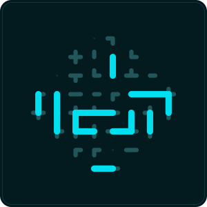
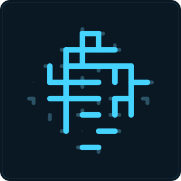
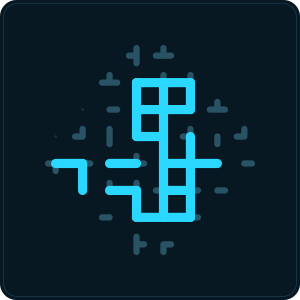
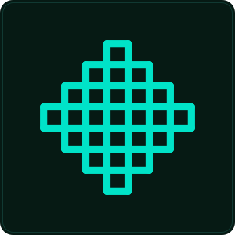

# $$K.1 — ERC-20 с фиксированной эмиссией

Простой токен на Solidity 0.8.30 + OpenZeppelin 5.6. Без владельца, без допэмиссии,
без комиссий на перевод.

**Выпущен в Base:** [`0x72883511A0B1dE1fF1cA0669D0C3dE699D56c0a8`](https://basescan.org/token/0x72883511A0B1dE1fF1cA0669D0C3dE699D56c0a8)

```bash
npm install
npm test
```

Тесты гоняют настоящий EVM в памяти (`@ethereumjs/vm`) — без нод, сети и Foundry.

## Что внутри

| Файл | |
|---|---|
| [contracts/FixedSupplyToken.sol](contracts/FixedSupplyToken.sol) | сам токен, 46 строк |
| [scripts/compile.mjs](scripts/compile.mjs) | компиляция solc-js → `artifacts/` |
| [scripts/deploy.mjs](scripts/deploy.mjs) | деплой через viem, с оценкой газа и подтверждением |
| [scripts/verify.mjs](scripts/verify.mjs) | верификация исходников на Basescan одной командой |
| [scripts/logo.mjs](scripts/logo.mjs) | нарезка `assets/logo-src.png` в 256/128/64/32 |
| [scripts/token-list.mjs](scripts/token-list.mjs) | token list формата Uniswap — откуда кошельки берут иконку |
| [scripts/sigil.mjs](scripts/sigil.mjs) | адрес → 40 клеток восьмиугольника и обратно, признаки печати |
| [scripts/render.mjs](scripts/render.mjs) | отрисовка печати в SVG, палитра из keccak |
| [scripts/mine.mjs](scripts/mine.mjs) | подбор адреса с красивой печатью, локально |
| [test/harness.mjs](test/harness.mjs) | локальный EVM: deploy / read / write / разбор revert-ов |

## Свойства

- **Supply фиксирован.** Всё чеканится в конструкторе. `mint` в ABI нет, владельца нет —
  допечатать нельзя никак. Проверяется тестом.
- **Никаких привилегий.** Ни pause, ни blacklist, ни комиссии на transfer. Никто, включая
  деплоера, не может тронуть чужой баланс или заблокировать перевод.
- **Permit (EIP-2612).** Allowance по подписи, без газа со стороны держателя.
- **Burnable.** Каждый может сжечь свои токены.
- **Параметры задаются при деплое** — имя, тикер, decimals и объём, контракт не пересобирается.

3957 байт задеплоенного кода, transfer ~34.5k газа.

## Деплой

### Сначала тестнет

Нужен приватный ключ **отдельного** кошелька (не основного) и тестовые монеты из крана —
для Base Sepolia это `https://faucet.quicknode.com/base/sepolia`.

```bash
PRIVATE_KEY=0x... TOKEN_NAME='$$K.1' TOKEN_SYMBOL='$$K.1' npm run deploy
```

Скрипт печатает сеть, баланс и оценку газа **до** отправки.

### Мейннет

Те же переменные плюс сеть и `CONFIRM=yes`; скрипт дополнительно спросит тикер вручную:

```bash
PRIVATE_KEY=0x... CHAIN=base CONFIRM=yes TOKEN_NAME='$$K.1' TOKEN_SYMBOL='$$K.1' npm run deploy
```

`CHAIN` — имя из `viem/chains`: `base`, `arbitrum`, `optimism`, `polygon`, `mainnet`.
В Ethereum mainnet деплой стоит десятки долларов, в L2 — центы. Разницы в коде нет.

| Переменная | По умолчанию | |
|---|---|---|
| `PRIVATE_KEY` | — | обязательна |
| `CHAIN` | `baseSepolia` | сеть из `viem/chains` |
| `RPC_URL` | публичный RPC сети | свой узел, если нужен |
| `TOKEN_NAME` | `$$K.1` | название в кошельке |
| `TOKEN_SYMBOL` | `$$K.1` | тикер |
| `TOKEN_DECIMALS` | `18` | знаков после запятой |
| `TOKEN_SUPPLY` | `1000000` | эмиссия в целых токенах |
| `HOLDER` | адрес деплоера | кому уходит весь supply |
| `CONFIRM` | — | `yes` — обязательно для мейннета |

### Верификация

Пока исходники не верифицированы, на explorer-е виден только байткод, и контракт
выглядит как чёрный ящик. Нужен бесплатный ключ с `etherscan.io/myapikey` (один
работает для всех сетей):

```bash
ETHERSCAN_API_KEY=... TOKEN_ADDRESS=0x... HOLDER=0x... CHAIN=base npm run verify
```

Скрипт собирает Standard JSON Input, шлёт его и ждёт результат. Что байткод сойдётся,
проверяется тестом заранее — [test/verify.test.mjs](test/verify.test.mjs) компилирует
тот же вход и сверяет с задеплоенным.

## Как это выглядит в кошельке

В ERC-20 нет поля под логотип: кошелёк читает только `name`, `symbol`, `decimals`
и баланс. Иконка приезжает из внешних списков.

```bash
npm run logo
```

Берёт `assets/logo-src.png` и нарезает в 256/128/64/32 (256 — размер, который
требуют token list и trustwallet/assets; 32 — как иконка выглядит в списке).
Чтобы поменять логотип, замени исходник и перезапусти.

Дальше нужен постоянный URL — например, публичный репозиторий на GitHub и raw-ссылка:

```bash
TOKEN_ADDRESS=0x... LOGO_URL=https://.../logo-256.png npm run token-list
```

Получится `assets/tokenlist.json` формата Uniswap: его можно подключить прямо
по URL в интерфейсе Uniswap или подать в каталоги.

Что всё равно останется: токен не появится у людей сам — его импортируют по адресу
контракта; цена будет пустой, пока нет пула ликвидности.

## Печать адреса

Адрес — это 40 hex-символов. Каждый символ — 4 бита, и эти 4 бита читаются как четыре
выхода клетки: север, восток, юг, запад. Клетки уложены в восьмиугольник, в котором
ровно 40 мест. Линия между соседями появляется там, где встречные выходы совпали;
всё остальное остаётся обрывком.

<p align="center">
  
  
  
  
</p>

Это **не** хеш-иконка вроде blockies или jazzicon. Отображение биективное: из картинки
адрес читается обратно, символ за символом. Картинка не «сделана по адресу» — она и есть
адрес, записанный другим алфавитом.

```bash
npm run sigil 0x0cf1430E31B264a262aFF5fBA4D577daB5660A2a
```

Кладёт SVG в `marks/` и печатает признаки. Регистр и префикс `0x` на картинку не влияют:
EIP-55 — это контрольная сумма, а не часть адреса. А вот **цвет** берётся именно из
keccak — того же хеша, что даёт EIP-55. Один тон на всю печать, меняется только оттенок.
Опечатка в одном символе сдвинет одну клетку, но перекрасит оттиск целиком, и это видно
раньше, чем находится сам символ.

### Признаки

| | |
|---|---|
| `links` | сшитые стыки, где обе половины линии на месте. Максимум 64 |
| `stubs` | выходы, которым некуда идти: обрывы |
| `score` | `links - stubs` |
| `cycles` | замкнутых контуров: `E - V + C` по сшитым линиям |
| `bar` | длиннейшая сплошная линия, в клетках. Максимум 8 |
| `rotation` | клеток, совпавших с собой при повороте на 90°. Из 40 |
| `mirror` | то же для отражения по вертикали |

У случайного адреса сшивается ровно четверть линий — в среднем 16 стыков из 64, это
проверяемое свойство, а не наблюдение: два независимых нибла совпадают встречными
битами с вероятностью ¼. Поэтому обычная печать выглядит как россыпь чёрточек,
а подобранная — как узор.

### Блатные номера

```bash
npm run mine -- --cycles 3 --minutes 5
npm run mine -- --score 2 --prefix beef --minutes 10
```

Перебор идёт локально, ~21k адресов в секунду на одном ядре: берётся случайный ключ `k`,
дальше `k+1, k+2, …` — на кривой это прибавление точки `G` к предыдущей, одно сложение
вместо полного умножения. Найденный ключ пишется в `marks/<адрес>.key` с правами `600`
и в консоль не выводится; `--show` печатает его в stdout вместо файла.

Насколько редок каждый порог — замерено на 4 000 000 случайных адресов, а не оценено:

| Порог | Один из | На одном ядре |
|---|---|---|
| `--bar 8` | 4 100 | мгновенно |
| `--cycles 3` | 2 600 | мгновенно |
| `--rotation 10` | 7 000 | секунда |
| `--mirror 14` | 6 700 | секунда |
| `--score 0` | 97 600 | ~5 секунд |
| `--rotation 12` | 174 000 | ~8 секунд |
| `--cycles 5` | 1 000 000 | ~минута |
| `--score 4` | 1 000 000 | ~минута |

Дальше стена: на 4 миллионах замеров `score 5` встретился один раз, и каждая следующая
единица дороже предыдущей в 3–4 раза, так что `score 6` — это уже десятки миллионов
перебора. Симметрию видно хуже, чем кажется по числам: `mirror 18/40` — редкость 1 к
800 000, но глазом печать читается лишь как «половина узора похожа на вторую», потому
что оставшиеся 22 клетки шумят.

Эталон — единственная раскладка, где сшито всё, что можно, и не торчит ничего:

```
0x6c6ffc6ffffc6ffffffc3ffffff93ffff93ff939
```

64 стыка, 0 обрывов, 25 колец, обе симметрии полные. Его нельзя подобрать — вероятность
2⁻¹⁶⁰. Он существует как верхняя отметка шкалы, и приватный ключ к нему, скорее всего,
не найдёт никто и никогда.

### Что это не даёт

Печать — способ **сверить** адрес глазами, а не доказать его подлинность. Подделать
похожую картинку тем же перебором можно: злоумышленник ищет адрес, чей оттиск близок к
вашему, ровно так же, как вы искали красивый. Разница только в цене перебора. Проверка
адреса символ за символом остаётся обязательной.

## Что деплой не даёт

- **Цены и ликвидности.** Токен нельзя купить, пока кто-то не заведёт пул на Uniswap
  и не положит туда реальные деньги.
- **Логотипа.** В ERC-20 нет поля под картинку. Иконку кошельки берут из внешних списков
  (token list, trustwallet/assets) — это отдельная заявка.
- **Автопоявления в кошельках.** Получателям придётся импортировать токен по адресу.
- **Аудита.** Кирпичи OpenZeppelin аудированы, конкретно эта сборка — нет.

## Про название

`name` и `symbol` — обычные строки, реестра уникальности не существует, поэтому в них
проходит и `$`, и точка. Единственный настоящий идентификатор токена — адрес контракта.

Один практический момент: `$$` в шелле раскрывается в PID процесса, то есть
`TOKEN_SYMBOL="$$K.1"` в двойных кавычках уедет в мейннет как `11519K.1`. Отсюда
одинарные кавычки во всех командах выше. Скрипт печатает итоговые имя и тикер до
отправки транзакции — их стоит прочитать глазами.
